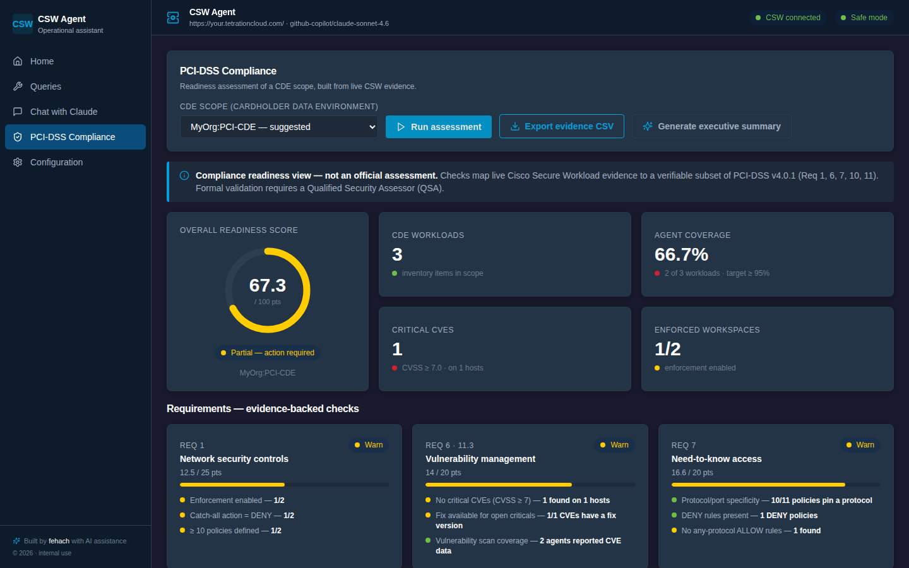
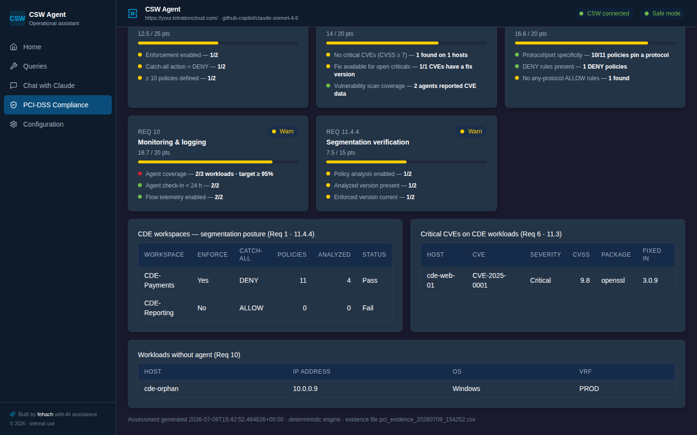

# Workload Atlas — AI copilot for Cisco Secure Workload

> *Working title — the Python package keeps its internal name `csw-agent`.*

AI-powered assessment, operations and reporting for **Cisco Secure Workload (CSW/Tetration)**,
built for security teams and Cisco partners. Ask questions in natural language; get validated,
sandbox-checked API operations, evidence-backed assessments and exportable reports — with a
services roadmap extending to **Secure Network Analytics (SNA)**.

> **Independent project.** Not affiliated with, endorsed by, or sponsored by Cisco Systems, Inc.
> Cisco, Cisco Secure Workload, Tetration, Secure Network Analytics and Cisco XDR are trademarks
> of Cisco Systems, Inc. This tool consumes the products' public OpenAPI interfaces.



## For Cisco partners

**Why now:** Cisco has announced end-of-life for the Secure Workload M5/M6 hardware appliances.
CSW itself continues — as SaaS, or as software running on customer-prepared virtualized
infrastructure (VMware/ESXi). Every deployment on that hardware has a migration project in its
future, with a hard deadline set by the support calendar. This toolkit automates the assessment,
evidence and validation work inside those projects.

| Service package | Outcome for the end customer | How this toolkit accelerates it |
|---|---|---|
| [**Appliance-to-software migration**](docs/partners/migration-assessment.md) (M5/M6 → SaaS or on-prem virtual cluster) | CSW continuity beyond hardware EoL, with proof nothing was lost in the move | Automated deployment baseline, migration readiness report, post-migration assurance diff *(module in roadmap — data collection already built)* |
| [**PCI-DSS readiness assessment**](docs/partners/pci-readiness.md) | Audit-ready evidence of segmentation posture for the CDE | One-click scope assessment: 100-point deterministic score, evidence CSV, AI executive summary *(built — see `feature/pci-dss-dashboard`)* |
| [**Segmentation maturity assessment**](docs/partners/segmentation-maturity.md) | Prioritized roadmap from visibility to full enforcement | Reproducible 100-point maturity scoring per workspace/scope, bulk or deep-dive |
| [**SNA ↔ XDR integration & playbooks**](docs/partners/sna-xdr-integration.md) | Detections that turn into documented, repeatable response | *(Roadmap)* Integration validation checks and AI-assisted playbook documentation |

Details, deliverables and typical durations: [`docs/partners/`](docs/partners/README.md).
A demo mode with synthetic data (no CSW tenant required) is on the near-term roadmap.



## What the product does

- **Natural-language operations**: questions in plain English or Spanish become Python that
  calls the CSW OpenAPI — statically validated in an AST sandbox before execution, with
  destructive calls blocked by default.
- **Pre-built query catalog**: 16 deterministic read-only queries (agents, workspaces,
  enforcement gaps, CVE reports) usable from CLI or web dashboard, no LLM required.
- **Assessments with evidence**: PCI-DSS readiness and segmentation maturity scoring with
  exportable CSV evidence and AI-generated executive narratives.
- **Web dashboard**: dark, Cisco-console-compatible UI (React + FastAPI + SSE streaming) with
  live telemetry: latency percentiles, token usage, success rates.

## Requirements

- Python 3.10+
- Network access to your CSW deployment
- A running ClaudeGate (or Anthropic-compatible) endpoint
- A CSW API credentials JSON file with `api_key` / `api_secret`

## Install

```bash
pip install -e ".[dev]"     # editable install with test dependencies
# or
pip install .
```

## Configure

Place credentials at `~/.csw/credentials.json` with permissions `600`:

```bash
mkdir -p ~/.csw
chmod 700 ~/.csw
mv path/to/credentials.json ~/.csw/credentials.json
chmod 600 ~/.csw/credentials.json
```

All other settings can be set via env vars or CLI flags:

| Setting | Env var | CLI flag | Default |
|---|---|---|---|
| API endpoint | `CSW_ENDPOINT` | `--endpoint` | `https://your.tetrationcloud.com/` |
| Credentials path | `CSW_CREDENTIALS` | `--credentials` | `~/.csw/credentials.json` |
| TLS verification | `CSW_VERIFY_TLS` | `--insecure` to disable | `true` |
| Safe mode (confirm destructive calls) | `CSW_SAFE_MODE` | `--unsafe` to disable | `true` |
| Claude model | `CLAUDE_MODEL` | `--model` | `github-copilot/claude-sonnet-4.6` |
| ClaudeGate URL | `CLAUDEGATE_URL` |  | `http://localhost:9999` |
| ClaudeGate API key | `CLAUDEGATE_API_KEY` |  | `sk-ant-dummy-key` |
| Log level | `CSW_LOG_LEVEL` | `-v` / `-vv` | `INFO` |

## Run

```bash
csw-agent              # installed entry point (interactive CLI)
python -m csw_agent    # equivalent
csw-agent dashboard    # launch the web dashboard at http://127.0.0.1:8765
```

The dashboard requires the `dashboard` extra: `pip install -e ".[dashboard]"`.
For frontend development see [`dashboard/README.md`](./dashboard/README.md).

Once running:

- `query` — open the query menu (Claude AI mode by default; `local` switches to the catalog).
- `safe` — toggle safe mode.
- `info` — show the active configuration.
- `quit` — exit.

In Claude AI mode, type a question. The generated code is shown, validated by the AST sandbox,
and executed only if it does not perform destructive operations (or you confirm them).

## Safety model

Code generated by Claude is executed inside an AST-validated sandbox. The validator rejects:

- Imports outside the allow-list (`json`, `datetime`, `time`, `re`, `math`, `collections`,
  `itertools`).
- `open`, `eval`, `exec`, `compile`, `__import__`, `input`, `breakpoint`, `globals`, `locals`,
  `vars`, `getattr`/`setattr`/`delattr`/`hasattr`.
- Any dunder attribute access (`obj.__class__`, …).
- `restclient.delete/post/put/patch` and `api_call('DELETE'|'PUT'|'PATCH', …)` unless safe mode
  is off.
- `api_call('POST', …)` to non-read-only endpoints.

Read-only POSTs (`/inventory/search`, `/inventory/count`, `/flowsearch`, `/policies/stats`,
`/inventory/cves`) are allow-listed.

Enable destructive calls explicitly with `--unsafe`. Even then the agent will ask before
executing.

## For engineers & recruiters

The full technical story — architecture and workflow diagrams, how the AI layer was built via
context engineering (no fine-tuning), the sandbox safety model, observability and engineering
practices — lives in [`docs/AGENT_OVERVIEW.md`](docs/AGENT_OVERVIEW.md).

Feature branches pending merge: `feature/pci-dss-dashboard` (PCI-DSS compliance page),
`claude/agent-review-documentation-pi4h3n` (original technical overview doc).

## Development

```bash
pip install -e ".[dev]"
ruff check .
ruff format --check .
mypy csw_agent
pytest
```

## Layout

```
csw_agent/
├── ai/
│   ├── claude.py         # streaming + execution
│   ├── sandbox.py        # AST safety validator
│   └── prompts/*.md      # system / API reference / CSV
├── dashboard/            # FastAPI app + React static build
│   ├── app.py            # routes (REST + SSE)
│   ├── aggregations.py   # pure helpers used by /api/*
│   ├── server.py         # uvicorn launcher
│   └── state.py          # shared state (CSW client + caches)
├── queries/              # pre-built query catalog
├── telemetry.py          # in-memory ring buffers (events, logs, alerts)
├── cli.py                # argparse entry point + 'dashboard' subcommand
├── client.py             # CSWClient wrapper (telemetry-instrumented)
├── config.py             # Settings dataclass
├── csv_tools.py          # helpers for CSV mode
├── cache.py              # TTL cache for hostname→workspace mapping
└── tabulate_fallback.py  # works without `tabulate` installed

dashboard/                # Vite + React + TS + Tailwind frontend
├── src/{components,pages,hooks,api}
└── tailwind.config.ts    # Cisco palette (CLAUDE.md)

docs/
├── AGENT_OVERVIEW.md     # technical deep-dive (engineers/recruiters)
├── partners/             # service one-pagers (Cisco partners)
└── img/                  # product screenshots
```

## Authors & services

- **Federico Hach**
- **Diego Aguilar**

For partner services engagements (CSW migrations, assessments, SNA/XDR integration), contact
the authors.
