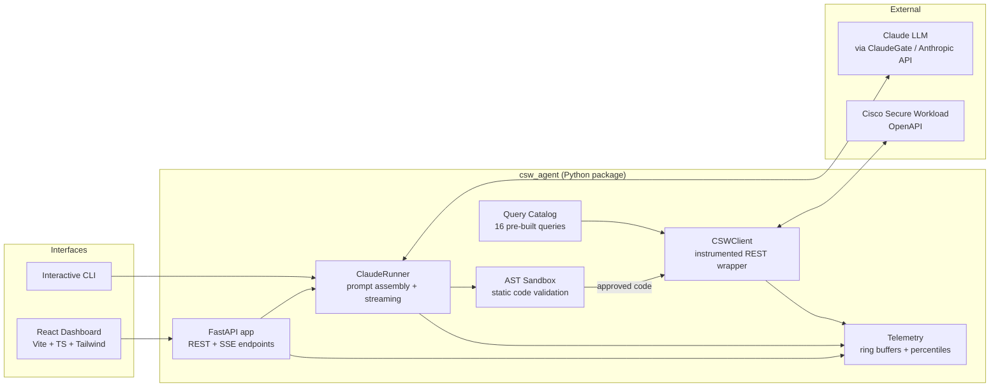
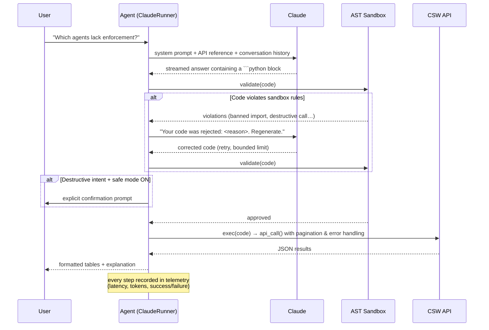

# CSW Agent — Technical Overview

> **An AI agent that turns natural-language questions into live, validated API operations
> against Cisco Secure Workload (Tetration) — with a code-generation sandbox, a
> self-correction loop, full observability, and a production-style web dashboard.**

- **Authors:** Federico Hach, Diego Aguilar
- **Stack:** Python 3.10+ · Anthropic SDK (Claude) · FastAPI · React + TypeScript + Tailwind
- **Quality gates:** 99 unit tests · ruff (lint + format) · mypy · GitHub Actions CI (3 Python versions + frontend build)

---

## 1. What the agent does

Cisco Secure Workload (CSW/Tetration) is a micro-segmentation platform whose OpenAPI is
powerful but complex: dozens of endpoints, inconsistent response shapes (some return
`{results: [...]}`, others plain lists), mandatory pagination, and domain concepts
(workspaces, scopes, enforcement, catch-all policies) that require expertise to query
correctly.

**CSW Agent removes that barrier.** A network or security engineer types a question in
plain English or Spanish —

> *"Which workspaces have enforcement enabled but no DENY rules?"*
> *"Show me the segmentation maturity score of every workspace in the CLOUD scope."*

— and the agent:

1. Sends the question to **Claude** together with a curated system prompt and a compact
   CSW API reference.
2. Receives **Python code** generated by the model.
3. **Statically validates** that code in an AST sandbox (no file access, no arbitrary
   imports, no destructive API calls unless explicitly allowed).
4. **Executes** the approved code against the live CSW deployment and renders the results
   as formatted tables.
5. If the sandbox rejects the code, it **feeds the violation back to Claude** and asks it
   to regenerate a compliant version — an automatic self-correction loop.

It also ships three complementary modes:

| Mode | Description |
|---|---|
| **AI mode (chat)** | Free-form natural-language querying via Claude, in the CLI or the web dashboard (streamed over SSE). |
| **Local mode (catalog)** | 16 pre-built, deterministic read-only queries (agent summaries, scope hierarchy, enforcement gap analysis, CVE reports with CSV export…) that work even with no LLM available. |
| **CSV chat mode** | After any query exports a CSV, the user can converse with that dataset: Claude generates pandas-free analysis code that runs against the loaded rows with type-safe helpers (`to_number`, `to_bool`, `safe_pct`…). |

A **web dashboard** (FastAPI backend + React frontend following Cisco's design system)
exposes the chat, the query catalog, live activity logs, latency percentiles (p50/p95/p99),
token consumption, and configuration — everything backed by an in-process telemetry store.

---

## 2. How it works — architecture & workflow

### Component architecture

### One chat turn, end to end

Key design decisions:

- **`(data, error)` tuples instead of exceptions** for API calls: the generated code can
  handle failures with a pattern the model reliably reproduces.
- **Bounded conversation memory** (last N turns) to control token costs and context drift.
- **Self-correction with a retry limit** (`syntax_retry_limit`): the sandbox verdict is
  injected back as a user message so the model can repair its own output — but the loop
  cannot run away.
- **TTL caching** for the expensive hostname→workspace mapping (5-minute cache), avoiding
  redundant API sweeps.
- **Graceful degradation**: if Claude is unreachable the CLI falls back to local catalog
  mode; if `tabulate` is missing a pure-Python fallback renders tables.

---

## 3. How the AI layer was built (spoiler: no training required)

An important engineering point: **this agent does not fine-tune or retrain any model.**
It uses a pre-trained frozen LLM (Claude) and achieves domain competence entirely through
**context engineering / in-context learning**. That was a deliberate choice:

| Approach | Why we did / didn't use it |
|---|---|
| **Fine-tuning** | ❌ Not needed. There is no large corpus of CSW Q&A pairs, the API surface changes with product versions, and fine-tuning would freeze knowledge that is cheaper to update in a prompt file. |
| **RAG (vector retrieval)** | ❌ Overkill at this scale. The relevant API knowledge compresses into a ~190-line curated reference that fits comfortably in context — retrieval would add latency and failure modes without benefit. |
| **Prompt / context engineering** | ✅ Chosen. All domain expertise lives in versioned Markdown files (`csw_agent/ai/prompts/`), reviewable in pull requests like any other code. |

The "knowledge" of the agent is distilled into three artifacts:

1. **`system.md`** — behavioral contract and 24 hard rules learned from real failure
   modes during development. Examples: which endpoints return dicts vs. plain lists
   (crashes otherwise), mandatory pagination for ~1800 agents (a single page silently
   returns 500), combining `absolute_policies` + `default_policies` (ignoring the latter
   yields empty results), division-by-zero guards, ISO-8601 timestamps for flow search.
   It also encodes a complete **workspace-maturity scoring methodology** (9 weighted
   criteria, 100 points, 5 maturity levels) so that assessments are reproducible across
   sessions rather than improvised by the model each time.
2. **`api_reference.md`** — a hand-curated, token-efficient distillation of the CSW
   OpenAPI: endpoints, exact response shapes, attribute lists, and per-endpoint danger
   annotations (e.g. `DELETE /sensors/{uuid} — DANGEROUS`).
3. **`csv_system.md`** — a separate persona for the CSV-analysis mode, with typed helper
   functions injected into the execution namespace so the model never re-implements
   fragile parsing.

The effective "training loop" of this project was therefore **iterative prompt
refinement driven by observed failures**: run a real question → watch the generated code
fail or misbehave → encode the correction as a numbered rule or an API-reference note →
verify with the sandbox/tests. Every rule in `system.md` is a regression fix, in the same
way that every test in a test suite is.

At runtime this is complemented by two feedback mechanisms:

- **Sandbox-mediated self-correction** — static analysis findings are returned to the
  model as natural language so it can regenerate compliant code (bounded retries).
- **Token-budget awareness** — truncated responses (`stop_reason == "max_tokens"`) are
  detected and surfaced to the user instead of executing half a program.

---

## 4. Safety model

LLM-generated code is executed, so the project treats the model as an **untrusted code
author**. Defense in depth:

1. **AST static validation before `exec()`** (`csw_agent/ai/sandbox.py`):
   - Import allow-list: only `json`, `datetime`, `time`, `re`, `math`, `collections`, `itertools`.
   - Banned builtins: `open`, `eval`, `exec`, `compile`, `__import__`, `input`,
     `globals`, `locals`, `vars`, `breakpoint`, …
   - No dunder attribute access (`obj.__class__`, `__globals__`, …) — blocks the classic
     Python sandbox escapes.
   - No dynamic attribute primitives (`getattr`/`setattr`/`delattr`/`hasattr` calls).
2. **Destructive-intent detection**: `restclient.delete/post/put/patch` and
   `api_call('DELETE'|'PUT'|'PATCH', …)` are flagged. POST is only allowed to an explicit
   allow-list of read-only endpoints (`/inventory/search`, `/flowsearch`,
   `/policies/stats`, …).
3. **Safe mode + human-in-the-loop**: destructive operations require the `--unsafe` flag
   *and* an interactive confirmation. Two independent gates.
4. **Credential hygiene**: credentials live in `~/.csw/credentials.json` (`chmod 600`),
   never in code or logs; legacy paths trigger warnings. TLS verification is on by
   default and disabling it logs a prominent warning.
5. **Restricted execution namespace**: generated code only sees the injected globals
   (`api_call`, `tabulate`, a few stdlib modules) — not the application's real module
   namespace.
6. **Prompt-level guardrails** as the outermost layer (rule 8: never generate destructive
   calls unless explicitly requested) — useful, but never *relied upon*: the sandbox is
   the enforcement point, the prompt is just the first filter.

The sandbox has a dedicated test suite (`tests/test_sandbox.py`), and the project
convention (see `AGENTS.md`) is that the allow-lists may only be changed together with a
corresponding test.

---

## 5. Observability

Every meaningful operation emits a telemetry event into thread-safe bounded ring buffers
(`csw_agent/telemetry.py`):

- **API calls** — method, path, latency, HTTP outcome.
- **Claude requests** — model, latency, input/output tokens, stop reason, question preview.
- **Catalog queries** — label, duration, success.
- **Logs** — a custom `logging.Handler` mirrors application logs into the buffer.

On top of this the dashboard computes on-demand aggregations: success rates, latency
percentiles (p50/p95/p99), per-minute time series, and token consumption — the numbers an
AI engineer actually needs to answer *"is the agent getting slower / more expensive /
less reliable?"*. Buffers are bounded (`deque(maxlen=…)`) so the process can run
indefinitely without memory growth.

---

## 6. Engineering practices

| Practice | Implementation |
|---|---|
| **Testing** | 99 unit tests across 9 modules; external dependencies (CSW client, Anthropic) are mocked so the suite runs offline in <1s. |
| **CI** | GitHub Actions: ruff lint + format check, mypy, pytest with coverage on Python 3.10/3.11/3.12, plus lint + production build of the React frontend. |
| **Typing** | Full type hints, `mypy` in CI, `dataclass(slots=True)` for hot-path objects. |
| **Configuration** | Single `Settings` dataclass; every parameter overridable via env var or CLI flag; zero hardcoded secrets. |
| **Packaging** | Standard `pyproject.toml` with optional extras (`[dashboard]`, `[dev]`), console entry point, prompts shipped as package data. |
| **Docs & conventions** | `README.md` for humans, `AGENTS.md` for AI/dev agents (verification commands, extension recipes), `CLAUDE.md` for design-system rules. Conventional commits. |
| **Frontend** | Vite + React + TypeScript + Tailwind, typed API client, SSE streaming hook, Cisco design tokens (dark theme, `#049FD9` palette) codified in `tailwind.config.ts`. |

---

## 7. Known limitations & roadmap

Honest limitations, and what production-hardening would look like:

- **AST validation is static, not a runtime jail.** It blocks the realistic escape
  vectors (imports, dunders, dynamic attribute access), but a hostile model could attempt
  obfuscations (e.g. aliasing builtins). Next step: execute generated code in an OS-level
  sandbox (subprocess with seccomp, container, or WASM runtime) with CPU/memory/time limits.
- **Single-user dashboard sessions.** Chat history is process-global by design (v1);
  multi-user support needs per-session state and auth.
- **In-memory telemetry only.** Restart loses history; a production deployment would sink
  events to Prometheus/OpenTelemetry.
- **Evaluation harness.** Prompt-rule regressions are currently caught manually; a golden
  suite of question→expected-behavior evals (run in CI against a mocked API) is the
  natural next investment.

---

## 8. Skills demonstrated in this project

For reviewers evaluating this repository as a portfolio piece:

- **LLM application architecture** — prompt/context engineering, streaming, conversation
  memory management, token budgeting, model-agnostic gateway integration (Anthropic SDK
  against a self-hosted proxy).
- **AI safety engineering** — sandboxed execution of model-generated code, destructive-action
  gating, human-in-the-loop confirmation, self-correction loops with bounded retries.
- **Domain modeling** — distilling a complex enterprise API (Cisco Secure Workload) into
  a token-efficient reference the model can use reliably, including a reproducible
  scoring methodology for segmentation maturity.
- **Full-stack delivery** — Python backend (FastAPI, SSE), typed React frontend under a
  corporate design system, packaging, CLI UX.
- **Production discipline** — tests, CI matrix, linting, typing, structured telemetry,
  graceful degradation, secure credential handling.
